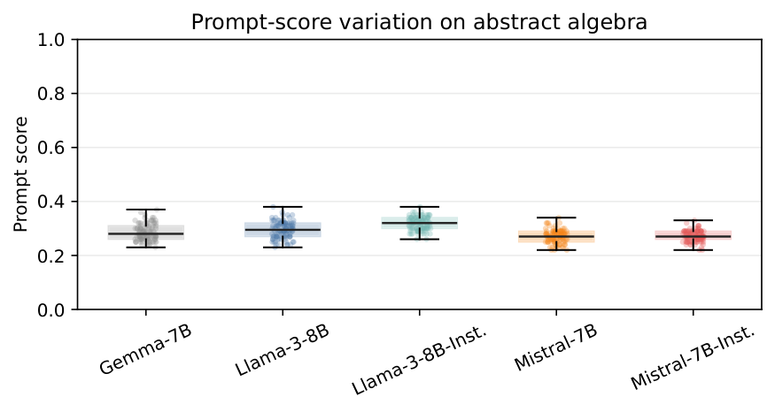
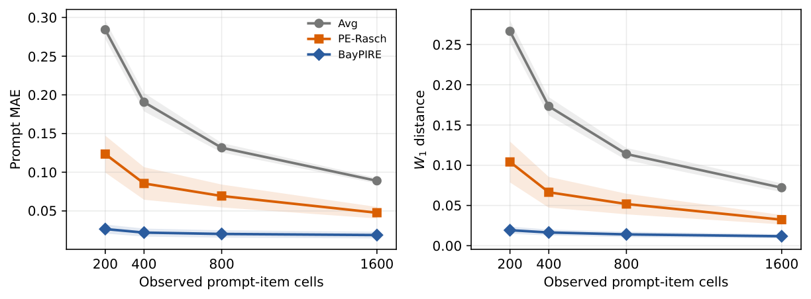
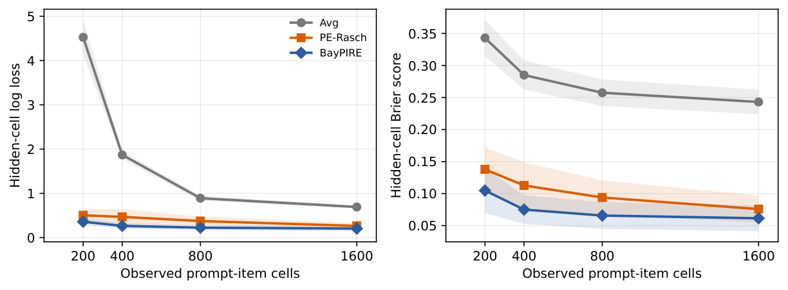
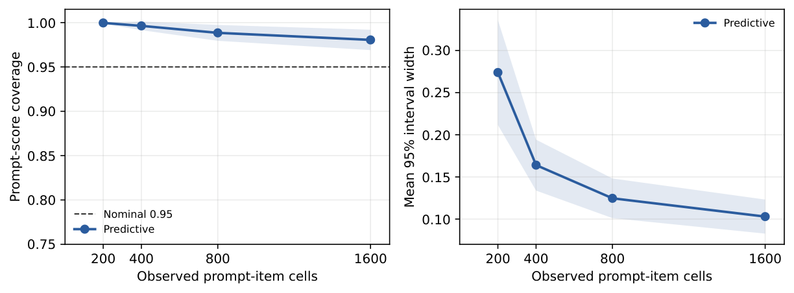
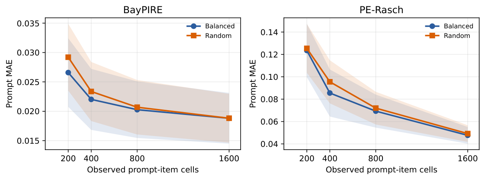

# BayPIRE

**Uncertainty-Aware Bayesian Prompt Imputation and Recovery for Sparse Multi-Prompt LLM Evaluation**

[Paper (PDF)](docs/baypire-paper.pdf) · [Presentation (PDF)](docs/baypire-slides.pdf) · [Document corrections](docs/document-notes.md) · [Results](results/mmlu_predictive/) · [Aggregate tables](docs/tables/)

BayPIRE estimates how an LLM performs across a fixed pool of prompt templates when only a small subset of prompt-item outcomes is observed. It recovers prompt scores and their empirical distribution, and provides posterior predictive intervals for the scores that exhaustive evaluation would reveal.

Research project by **Isaac Hung**, supervised by **Dr Sanna Passino**, Department of Mathematics, Imperial College London. The linked paper and presentation are the supplied September 2026 research documents.

## Why Multi-Prompt Evaluation?

A single prompt score can hide variation caused by prompt choice. On MMLU abstract algebra, the best and worst of 100 prompt templates differ by **12.8 percentage points on average across the five model splits** in this experiment.



The research questions are: **Can we recover this distribution from a small evaluation budget? How uncertain are the recovered scores?**

## Methodology

For a fixed LLM, let $Y^\star_{ij}\in\{0,1\}$ be correctness for prompt $i$ on item $j$. We observe only pairs in $\mathcal E$, with budget $|\mathcal E|=B$. The target prompt score is

$$
S_i^\star=\frac{1}{J}\sum_{j=1}^{J}Y^\star_{ij}.
$$

The distribution of these scores across the fixed prompt pool describes typical performance, lower-tail performance, and upper-tail performance.

### 1. Select Observations

The main experiment uses **two-way balanced sampling**: select a prompt with the fewest observations, then an unobserved item for that prompt with the smallest global item count, breaking ties randomly. This balances prompt counts and encourages item coverage. Uniform sampling without replacement provides a robustness check. Within each replicate, every method receives the same observed pairs.

### 2. Fit the Bayesian Item-Response Model

BayPIRE uses an additive Rasch model:

$$
Y_{ij}\mid\theta\sim\operatorname{Bernoulli}(p_{ij}),\qquad
p_{ij}=\operatorname{logit}^{-1}(\alpha+a_i-b_j).
$$

Here $\alpha$ is the global intercept, $a_i$ is a prompt effect, and $b_j$ is item difficulty. The likelihood uses only observed outcomes. Hierarchical priors regularise effects when observations are sparse:

$$
\alpha\sim N(0,5^2),\qquad
\sigma_a,\sigma_b\sim\operatorname{HalfNormal}(1).
$$

Independent standard-normal raw effects are centred and scaled:

$$
a_i=\sigma_a(a_i^{\mathrm{raw}}-\bar a^{\mathrm{raw}}),\qquad
b_j=\sigma_b(b_j^{\mathrm{raw}}-\bar b^{\mathrm{raw}}).
$$

The scales are inferred jointly with the other parameters, letting the data inform the amount of shrinkage. PyMC samples the posterior using **NUTS**, an adaptive Hamiltonian Monte Carlo algorithm.

### 3. Recover Scores and Quantify Uncertainty

| Output | Missing cells | Observed cells |
| --- | --- | --- |
| Point recovery | Average $p_{ij}$ over posterior draws | Retain realised outcomes |
| Predictive uncertainty | Sample Bernoulli outcomes using each draw's $p_{ij}$ | Retain realised outcomes |

For point recovery, average each completed row to obtain $\widehat S_i$, then form the empirical distribution and its quantiles. For uncertainty, compute scores for each posterior predictive completion; their 2.5th and 97.5th percentiles form a 95% predictive interval.

These completions represent uncertainty about **unobserved realised outcomes**; they do not rerun LLM generation. Coverage can be checked in this recovery experiment because the full released outcomes are available to the evaluator and hidden from the estimator.

## Experimental Setting

We use the released [PromptEval MMLU correctness data](https://huggingface.co/datasets/PromptEval/PromptEval_MMLU_correctness). **No new LLM inference is required.** Each model-subject pair is evaluated separately.

| Setting | Value |
| --- | --- |
| Prompt templates | 100 per model-subject pair |
| Model splits / subjects | 5 model splits and 10 MMLU subjects |
| Observation budgets | 200, 400, 800, 1600 prompt-item outcomes |
| Replicates | 10 masks per model-subject-budget-design setting |
| Sampling | Two-way balanced; uniform random for robustness |
| Main methods | Avg, PE-Rasch, BayPIRE |
| NUTS | 4 chains; 1000 tuning and 1000 retained draws per chain; target acceptance 0.97 |

The implementation uses up to 2000 pooled posterior draws for reconstruction. Diagnostics use the full retained chains. The recorded convergence flag requires maximum $\widehat R<1.05$ and no divergent transitions; effective sample size is also recorded. These diagnostics are not a proof of convergence.

**Models:** `google_gemma_7b`, `meta_llama_llama_3_8b`, `meta_llama_llama_3_8b_instruct`, `mistralai_mistral_7b_v0_1`, `mistralai_mistral_7b_instruct_v0_2`.

**Subjects:** abstract algebra, anatomy, astronomy, business ethics, clinical knowledge, college biology, college chemistry, college computer science, college mathematics, and college physics.

### Baselines

- **Avg:** observed prompt mean, with the global observed mean as fallback for an unobserved prompt.
- **PE-Rasch:** the official PromptEval `ExtendedRaschModel`, followed by observed-retention reconstruction. The reference code uses scikit-learn logistic regression with `C=100`; it should not be described as strictly unregularised MLE.
- **BayPIRE:** hierarchical Bayesian additive IRT with posterior averaging and posterior predictive uncertainty.

Bayes-MAP remains available in the software as an additional regularised point-estimation comparison, but is excluded from the main paper figures below. The main comparison alone does not isolate the contributions of shrinkage, learned scales, and posterior averaging.

## Results

Balanced-mask results average the ten mask replicates within each model-subject setting, then average over **50 model-subject combinations**. Scores and errors are on the 0-to-1 accuracy scale. Lower point errors and probability losses are better.

### Point and Distributional Recovery



| Budget | Avg MAE | PE-Rasch MAE | BayPIRE MAE | BayPIRE Wasserstein-1 |
| ---: | ---: | ---: | ---: | ---: |
| 200 | 0.284 | 0.124 | **0.027** | 0.019 |
| 400 | 0.191 | 0.086 | **0.022** | 0.016 |
| 800 | 0.132 | 0.069 | **0.020** | 0.014 |
| 1600 | 0.089 | 0.048 | **0.019** | 0.012 |

BayPIRE has the lowest aggregate prompt MAE and Wasserstein-1 distance among the three methods at every tested budget. At $B=200$, prompt MAE falls from 0.124 for PE-Rasch to 0.027 for BayPIRE.

### Hidden-Cell Probability Prediction



At $B=200$, BayPIRE obtains log loss **0.360** and Brier score **0.105**, compared with **0.505** and **0.138** for PE-Rasch. These assess predicted probabilities on hidden cells, complementing the primary score-distribution recovery target.

### Predictive Coverage and Width



| Budget | Prompt coverage | Mean prompt interval width | Mean-score coverage | Mean-score interval width | Convergence flag rate |
| ---: | ---: | ---: | ---: | ---: | ---: |
| 200 | 1.000 | 0.274 | 0.990 | 0.092 | 1.000 |
| 400 | 0.996 | 0.164 | 0.974 | 0.054 | 1.000 |
| 800 | 0.988 | 0.125 | 0.970 | 0.034 | 0.990 |
| 1600 | 0.981 | 0.103 | 0.960 | 0.022 | 0.934 |

Nominal 95% prompt intervals are **conservative**, with aggregate coverage of 98.1%-100%. They become narrower as the budget increases. The convergence flag rate falls to 93.4% at the largest budget, so computational diagnostics remain part of interpreting the results.

### Sampling Robustness



Both designs show similar trends. BayPIRE's aggregate prompt MAE is 0.027 versus 0.029 at $B=200$, and rounds to 0.019 under both designs at $B=1600$.

In these line plots, shaded bands show **plus/minus one standard deviation across model-subject mean results**, after averaging mask replicates. They describe between-setting variation, not confidence intervals or BayPIRE's posterior predictive intervals.

## Reproduce an Experiment

Run these commands from a clone of this repository, with Python 3.10 or later:

```bash
git clone https://github.com/ish24cho/baypire.git
cd baypire
python3 -m venv .venv
source .venv/bin/activate
python -m pip install -e .
python -m pip install datasets tqdm matplotlib
```

### Install the Official PromptEval Baseline

The upstream code is not bundled. To use the same local reference revision inspected for this release:

```bash
git clone https://github.com/felipemaiapolo/prompteval.git vendor/prompteval
git -C vendor/prompteval checkout c238d6473f2e7f956418b87ccd200e3165f9eb62
```

The adapter calls the official `ExtendedRaschModel` fitting code. It substitutes an unused utility import to avoid loading unrelated transformer dependencies. If the official source is absent, the adapter falls back to a local weakly regularised Rasch implementation. **Install the upstream source to reproduce the official-baseline comparison.** See [the adapter](src/baypire/models/pe_rasch.py).

### Download Released Correctness Data

Existing local subject chunks can be used directly. To import a single model and subject:

```bash
python scripts/download_prompteval_mmlu.py \
  --models meta_llama_llama_3_8b \
  --subjects abstract_algebra
```

To import all available subjects and models, optionally building a combined file:

```bash
python scripts/download_prompteval_mmlu.py --models all --combine
```

Chunks are saved to `data/external/prompteval_mmlu/chunks/`; the optional combined file is `data/processed/mmlu/correctness.parquet`. The importer skips existing chunks unless `--force` is supplied. Existing partial chunks may therefore need a forced refresh when expanding to more models. Downloading all released data is separate from reproducing the paper's five-model, ten-subject experiment.

### Run One Subject

```bash
python scripts/run_mmlu_subject_batch.py \
  --results-dir results/mmlu_predictive \
  --model-id meta_llama_llama_3_8b \
  --subjects abstract_algebra \
  --mask-types balanced random \
  --budgets 200,400,800,1600 \
  --n-masks 10 \
  --methods Avg PE-Rasch BayPIRE \
  --draws 1000 \
  --tune 1000 \
  --chains 4 \
  --target-accept 0.97
```

The batch runner skips existing summaries by default. Use a new `--results-dir`, such as `results/reproduction`, to run fresh fits while retaining supplied results. `--dry-run` lists jobs without fitting models. To run the ten paper subjects, replace the subject argument with:

```text
--subjects abstract_algebra anatomy astronomy business_ethics clinical_knowledge college_biology college_chemistry college_computer_science college_mathematics college_physics
```

Repeat for each model ID listed above. These repeated MCMC fits may take substantial time.

### Read the Outputs

```text
results/mmlu_predictive/{model_id}/{subject}/
  balanced/
    balanced.csv                  # per-mask, per-budget, per-method metrics
    balanced_summary.csv          # aggregated metrics and diagnostics
    balanced.json                 # run metadata
    run.log                       # batch execution log
  random/
    random.csv
    random_summary.csv
    random.json
    run.log
  balanced_vs_random_summary.csv
```

See [aggregate summaries](docs/tables/aggregate_subject_summaries.csv) and [model-subject summaries](docs/tables/all_subject_summaries.csv) for the tables underlying this README. Documentation figures are PNG exports of existing paper figures. The experiment code was not changed for this documentation release.

## Repository Layout

```text
docs/               Paper, slides, result figures, and aggregate tables
scripts/            Downloading, experiment entry points, and plotting
src/baypire/        Models, sampling designs, recovery, metrics, diagnostics
configs/            Experiment configurations
data/               Released correctness data and processed inputs
results/            Saved recovery results
tests/              Software checks
archive/olympiad/   Earlier experiments, outside the main MMLU study
```

## Scope and Limitations

The results concern a fixed prompt pool on released MMLU outcomes. They do not establish performance on all prompts or benchmarks. Predictive intervals rely on the additive model and conditional Bernoulli assumptions. The main comparison does not attribute the gain uniquely to Bayesian averaging. Conservative intervals, MCMC cost, and fits that fail diagnostics are limitations. Future work includes structured interactions and pooling across related groups, prior sensitivity, and repeated stochastic generation.

## Citation and Acknowledgments

```bibtex
@misc{hung2026baypire,
  author = {Hung, Isaac},
  title = {Uncertainty-Aware Bayesian Prompt Imputation and Recovery for Sparse Multi-Prompt LLM Evaluation},
  year = {2026},
  howpublished = {Second-year research project, Imperial College London},
  url = {https://github.com/ish24cho/baypire}
}
```

BayPIRE builds on [PromptEval](https://github.com/felipemaiapolo/prompteval) by Maia Polo et al. (2024) and its released correctness data. Please also cite PromptEval when using those data or its baseline. Posterior computation uses PyMC and ArviZ; the paper includes the NUTS and HMC references. See the paper for the full bibliography and acknowledgments.
